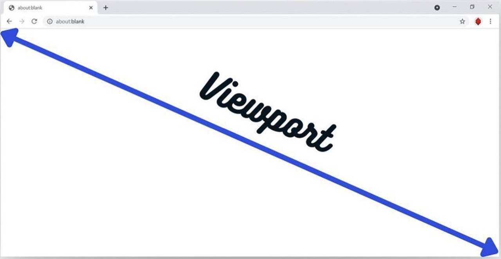
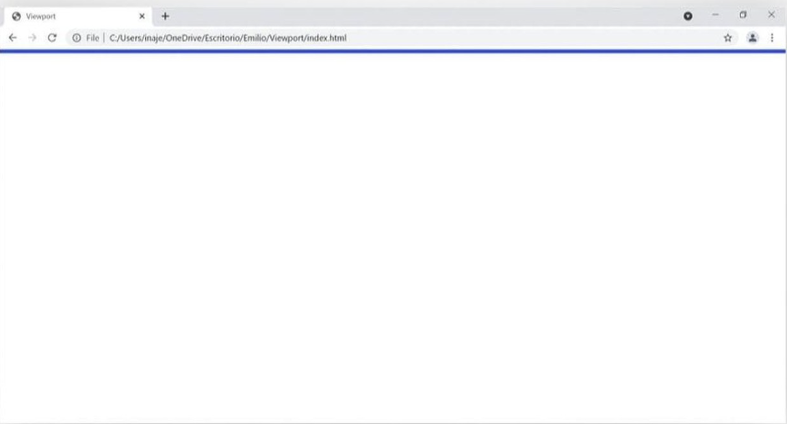
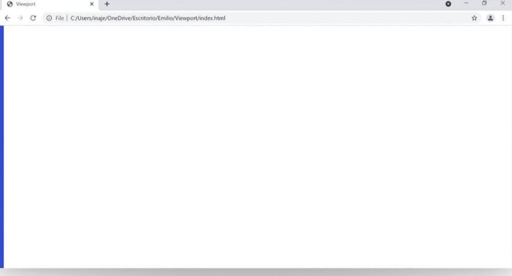

# General Notes

**VIEWPORT**:
  - Whole web screen
  
    

**1vh**:
  - 1 vertical height
  - Consider cutting 1 slice of viewport **in Horizontal way**

    

**1vw**:
  - 1 vertical width
  - Consider cutting 1 slice of viewport **in Vertical way**

    